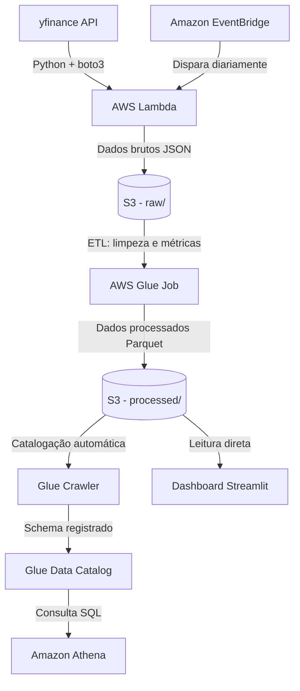

# 📊 Pipeline de Dados Financeiros na AWS

Pipeline de dados de ponta a ponta que coleta preços históricos de ações (Brasil + EUA), processa e transforma os dados na nuvem, e disponibiliza tudo em um dashboard interativo — usando serviços gerenciados da AWS.

#Arquitetura



#Sobre o projeto

Este projeto simula um pipeline de dados real de mercado financeiro, cobrindo o ciclo completo: **ingestão → automação → transformação → consulta → visualização**. Foi construído como projeto pessoal de portfólio, aplicando na prática os conhecimentos de AWS (certificação Cloud Practitioner), Python e SQL.

#Ativos monitorados
- **Brasil (B3):** PETR4, VALE3, ITUB4, BBAS3, WEGE3
- **EUA:** AAPL, MSFT, NVDA, AMZN, GOOGL

#Como funciona, etapa por etapa

| # | Etapa | Serviço AWS | O que faz |
|---|-------|-------------|-----------|
| 1 | **Ingestão** | AWS Lambda | Busca dados históricos via `yfinance` e salva como JSON bruto no S3 |
| 2 | **Automação** | Amazon EventBridge | Dispara a função Lambda automaticamente todo dia útil, após o fechamento do mercado |
| 3 | **Armazenamento bruto** | Amazon S3 | Guarda os arquivos JSON em `raw/`, organizados por data |
| 4 | **Transformação (ETL)** | AWS Glue | Consolida os dados, calcula métricas (variação diária, média móvel de 5 dias, volatilidade) e salva em Parquet particionado por ativo |
| 5 | **Catalogação** | Glue Crawler + Data Catalog | Detecta automaticamente o schema dos dados processados |
| 6 | **Consulta** | Amazon Athena | Permite consultas SQL diretamente sobre os arquivos no S3, sem banco de dados tradicional |
| 7 | **Visualização** | Streamlit + Plotly | Dashboard interativo lendo os dados processados direto do S3 |

#Stack técnica

- **Linguagem:** Python 3.13
- **Bibliotecas:** pandas, boto3, yfinance, pyarrow, streamlit, plotly, s3fs
- **AWS:** Lambda, EventBridge, S3, Glue (ETL + Crawler + Data Catalog), Athena
- **Formato de dados:** JSON (bruto) → Parquet (processado)

#Dashboard

 


#Como rodar localmente

```bash
# Clonar o repositório
git clone https://github.com/arthurbigal/pipeline-financeiro-aws.git
cd pipeline-financeiro-aws

# Criar ambiente virtual
python -m venv venv
venv\Scripts\activate  # Windows
source venv/bin/activate  # Mac/Linux

# Instalar dependências
pip install -r requirements.txt

# Configurar credenciais AWS (necessário ter uma conta AWS configurada)
aws configure

# Rodar a ingestão manualmente (opcional, já roda automaticamente via Lambda)
python src/ingestao.py

# Rodar o dashboard
streamlit run src/app.py
```

#Principais aprendizados e desafios

Durante o desenvolvimento, enfrentei e resolvi alguns problemas reais de infraestrutura cloud:

- **Compatibilidade de binários Lambda vs Windows:** bibliotecas como `pandas` precisaram ser reinstaladas com a flag `--platform manylinux2014_x86_64` para funcionar no ambiente Linux do Lambda, já que o desenvolvimento local foi feito no Windows.
- **Colunas duplicadas no particionamento:** ao particionar os dados por `ticker` no S3, uma coluna com o mesmo nome dentro do Parquet causava conflito de schema no Glue Crawler — resolvido removendo a coluna redundante antes de salvar.
- **Gerenciamento de memória no Lambda:** a configuração mínima (128MB) era insuficiente para carregar `pandas` e `yfinance`, causando falhas silenciosas — ajustado para 512MB.
- **Boas práticas de segurança:** uso de usuário IAM dedicado (nunca a conta root) para todas as operações via CLI e console.

#Possíveis melhorias futuras

- Adicionar camada de autenticação (Amazon Cognito) para controle de acesso ao dashboard
- Migrar consultas do Athena para uma camada de API (ex: com FastAPI)
- Expandir o job Glue para PySpark, caso o volume de dados cresça significativamente
- Adicionar testes automatizados (pytest) para as funções de transformação

#Autor

**Arthur Ricciardi Bigal**
Estudante de Ciência da Computação — PUC-Rio
[LinkedIn](https://www.linkedin.com/in/arthur-bigal-7520b6335)